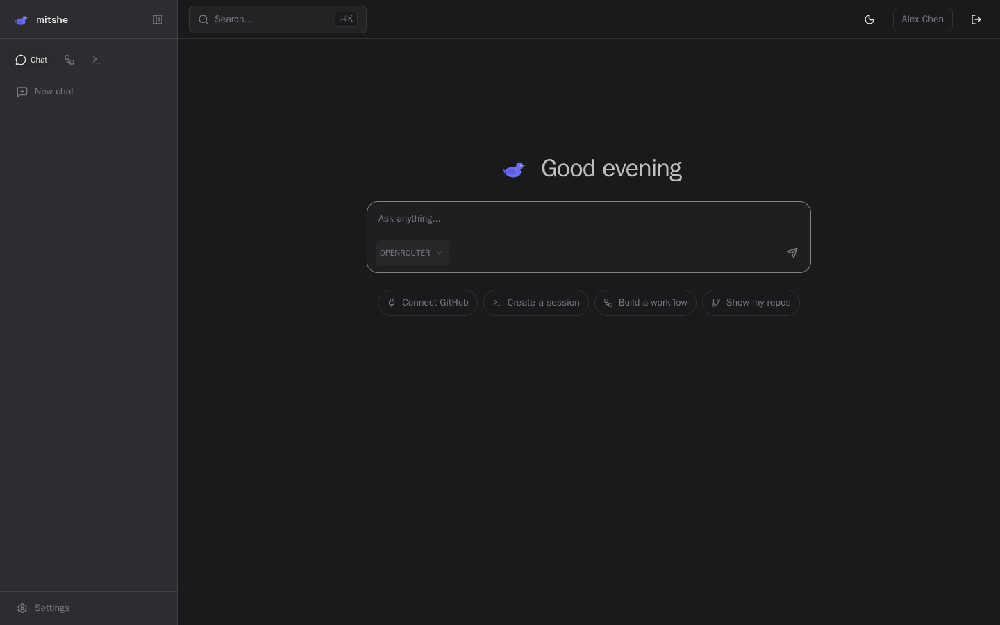

# mitshe

> Workspace manager for AI coding agents.

[](https://github.com/mitshe/mitshe/actions/workflows/ci.yml)
[](https://opensource.org/licenses/MIT)
[](https://discord.gg/KE2zm6njBf)

Manage Claude Code sessions, automate workflows, and orchestrate AI coding agents — all from a single self-hosted dashboard. Each session runs in an isolated Docker container with full terminal and git access. Self-hosted, bring your own API keys.



## Quick start

```bash
docker run -d \
  --name mitshe \
  -p 3000:3000 \
  -p 3001:3001 \
  -v mitshe-data:/build/data \
  -v /var/run/docker.sock:/var/run/docker.sock \
  ghcr.io/mitshe/mitshe:latest
```

Open **http://localhost:3000**, create an account, add your AI provider key.

## Features

- **Claude Code sessions** — isolated Docker containers with terminal, file editor, git access
- **Workflow engine** — visual builder with triggers, AI actions, git operations, notifications
- **Snapshots** — save a configured session state, spin up new sessions from it
- **Skills** — reusable instructions injected as Claude Code slash commands
- **Integrations** — GitHub, GitLab, Jira, Slack
- **Multi-provider** — Claude, OpenAI, OpenRouter, Gemini, Groq (BYOK)
- **Self-hosted** — your data, your keys, single Docker container with SQLite

## Update

```bash
docker stop mitshe && docker rm mitshe
docker pull ghcr.io/mitshe/mitshe:latest
docker run -d \
  --name mitshe \
  -p 3000:3000 \
  -p 3001:3001 \
  -v mitshe-data:/build/data \
  -v /var/run/docker.sock:/var/run/docker.sock \
  ghcr.io/mitshe/mitshe:latest
```

Data persists in the `mitshe-data` volume.

## Develop

```bash
# Prerequisites: Node.js 20+, pnpm 9+, Docker, just
git clone https://github.com/mitshe/mitshe.git
cd mitshe
just setup

# Configure
cp .env.example .env
cp apps/api/.env.example apps/api/.env

# Build executor image (required for sessions and workflows)
just executor-build

# Start
just dev
```

App: http://localhost:3000 <br />
API: http://localhost:3001 

run `just` to see all commands.

